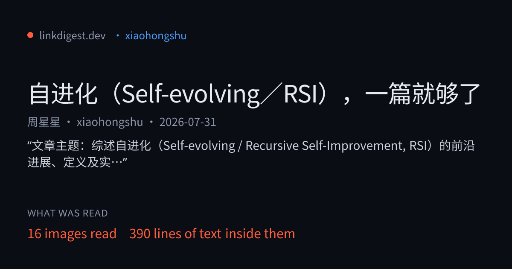

# LinkDigest MCP server

**中文文档：[README.zh-CN.md](README.zh-CN.md)** — 抖音、小红书链接转文本，MCP / Python SDK / 命令行，价格以人民币标注。

Turn a social media link into text a language model can read — **transcript,
on-screen text, image descriptions, caption and metadata**.

Hosted, remote (streamable HTTP). Nothing to install or run. For stdio-only clients and scripts,
[`python/`](python/) adds a zero-dependency Python SDK, a `linkdigest` command line and a
`linkdigest-mcp` stdio server that forwards to the hosted endpoint.

**Website:** [linkdigest.dev](https://linkdigest.dev) · **Registry:** `dev.linkdigest/linkdigest`

[](https://linkdigest.dev/d/5d0e7837ec2742ea4ae07806d979f0ce)

*Every digest comes with a receipt — how much was read, and a checked quote behind each key point. Works from Muse, Grok Bot, Manus Cue, Hermes, OpenClaw, Claude Code and Cursor: see [linkdigest.dev/connect](https://linkdigest.dev/connect). No key needed for a first look.*

## What this repository contains

The open parts: the Python SDK, the `linkdigest` command line and the `linkdigest-mcp` stdio server
([`python/`](python/), MIT), the Dify plugin source ([`dify/`](dify/)), the agent skill
([`skills/`](skills/)), examples, and the official MCP registry entry ([`server.json`](server.json)).
The hosted service behind `https://linkdigest.dev/mcp` and the API is operated by LinkDigest; its
reading engine is not open source.

## The problem

Fetching a social link yourself returns nothing useful. Share URLs are tokenised
(`xsec_token`, `app_code_link`), the content lives in video and images rather
than HTML, and the server sends an app-download shell or a login wall instead of
the post.

```
$ curl -sL 'https://xhslink.com/o/1WiQ1QI6Uc0' | grep -o '<title>.*</title>'
<title>小红书 - 你的生活兴趣社区</title>
```

That title belongs to a 36 KB app shell (checked 2026-10-04). No caption, no images, no text of the note.

## Install

**Claude Code**

```
claude mcp add --transport http linkdigest \
  https://linkdigest.dev/mcp \
  --header "Authorization: Bearer ld_live_..."
```

**Cursor, as a plugin** — this repo is a Cursor plugin (`.cursor-plugin/plugin.json` + `mcp.json` + `skills/`).
Install it from [cursor.directory](https://cursor.directory), then set the key once in your shell:

```
export LINKDIGEST_API_KEY=ld_live_...
```

The plugin's `mcp.json` reads `${LINKDIGEST_API_KEY}`; no key is stored in the repo. Without it,
the tool still lists and `tools/call` returns a 401 that says where to get one.

**Cursor, by hand** — `~/.cursor/mcp.json`

```json
{
  "mcpServers": {
    "linkdigest": {
      "url": "https://linkdigest.dev/mcp",
      "headers": { "Authorization": "Bearer ld_live_..." }
    }
  }
}
```

**stdio-only clients** — through [mcp-remote](https://github.com/geelen/mcp-remote) (Node.js):

```json
{
  "mcpServers": {
    "linkdigest": {
      "command": "npx",
      "args": ["-y", "mcp-remote", "https://linkdigest.dev/mcp", "--header", "Authorization:${AUTH_HEADER}"],
      "env": { "AUTH_HEADER": "Bearer ld_live_..." }
    }
  }
}
```

or through this repo's Python server (needs uv and git). It is installed from this git repository because
it is not on PyPI yet; a `linkdigest-mcp` package on PyPI is not ours until this README says so:

```json
{
  "mcpServers": {
    "linkdigest": {
      "command": "uvx",
      "args": ["--from", "git+https://github.com/jcaiagent7143-ui/linkdigest-mcp#subdirectory=python", "linkdigest-mcp"],
      "env": { "LINKDIGEST_API_KEY": "ld_live_..." }
    }
  }
}
```

A key is issued at [linkdigest.dev/app/keys](https://linkdigest.dev/app/keys).
10 free credits to start, once per account, no card. A post is one credit; video adds one per
started minute; a viral breakdown or a translation adds one each. Then $5 once for 250 credits
(Alipay accepted, settled as ¥36) or $9 a month for 500 (card).

## Agent skills (OpenClaw, Hermes, Claude Code, Cursor and others)

Eleven ready-made skills live in [`skills/`](skills). Each is one job, a `SKILL.md` plus one script that uses only the Python standard library. **No key needed for a first look**: without `LINKDIGEST_API_KEY` the script gives one free summary a day; with a key (10 free credits on sign-up, no card) it returns the full transcript and per-image text.

| Skill | Job |
| --- | --- |
| `xiaohongshu-note-to-text` | 小红书笔记转文字: a Xiaohongshu note, the text in every image, caption, stats |
| `douyin-video-to-text` | 抖音视频转文字: a Douyin video's spoken words, on-screen text, chapters |
| `tiktok-transcript` | A TikTok video's transcript with timestamps and captions |
| `long-video-transcript` | 长视频转文字: lectures and podcasts up to 2 h, 1 credit per 2 minutes |
| `linkdigest-xhs-note-ocr` | Xiaohongshu image notes, with the text inside every image |
| `linkdigest-video-transcript` | Douyin / Xiaohongshu video to transcript and on-screen text |
| `linkdigest-wechat-article-reader` | WeChat 公众号 articles: full text and every image's text |
| `linkdigest-youtube-summary` | YouTube summary and timed transcript, translated to Chinese on request |
| `linkdigest-xiaohongshu-douyin-reader` | Read Xiaohongshu / Douyin posts in English |
| `linkdigest-viral-breakdown` | How a viral post is built, with quotes checked against the source |
| `linkdigest-script-rewrite` | Extract a reference video's script and structure, then write your own |

```bash
# Any agent the skills CLI supports (Claude Code, Cursor, Codex, OpenClaw, Trae, Qwen Code, ...)
npx skills add jcaiagent7143-ui/linkdigest-mcp --skill xiaohongshu-note-to-text

# Hermes Agent
hermes skills install jcaiagent7143-ui/linkdigest-mcp/skills/xiaohongshu-note-to-text
hermes skills install clawhub/linkdigest-xhs-note-ocr   # or from ClawHub

# OpenClaw (ClawHub)
clawhub install jackchew7143/linkdigest-xhs-note-ocr
```

## The tool

`digest_url(url, format, job_id, translate_to, breakdown, partial_ok)` — only `url` is required.

| Argument | Notes |
|---|---|
| `url` | The post URL, including any share tokens. |
| `format` | `markdown` (default, best for reading) or `json` (structured). |
| `job_id` | Collect a digest already running. Pass this instead of `url` — re-sending the url would start the work again. |
| `breakdown` | `true` adds a viral breakdown (爆款拆解): the hook in its first seconds, the structure as timed beats, the title formula, cover text, call to action, audience and a reusable template. Quotes are checked word for word against the post; engagement and hashtags come from the platform. +1 credit. |
| `translate_to` | An ISO 639-1 code (`en`, `ja`, `zh-CN`): adds a translation beside the original, and writes the breakdown in that language. +1 credit. |
| `partial_ok` | `true` reads the opening minutes the budget affords instead of refusing a long video. |

You do not call it yourself. The tool description tells the agent to reach for it
whenever it meets a social link it cannot read, so it happens mid-task without
being asked.

A long video may not finish inside one call. When that happens the result names a
job id; call the tool again with that `job_id` and no `url` to collect it.

## What comes back

`platform`, `author`, `title`, `posted_at`, `caption`, `transcript` (`{t, text}`),
`ocr_text`, `on_screen` (`{t, text}`), `images` (`{description, ocr}`), `key_points`, `stats`
(likes, comments, saves, shares, plays), `tags`, `raw_markdown`, `source_url`, `transcript_source`,
`degraded` — plus `breakdown` and `translation` when asked for.

Two are worth knowing about:

- **`transcript_source`** — `native_captions`, `asr`, `gemini_video` or `none`. Captions the
  platform already published are exact; speech recognition is not. `gemini_video`
  means a YouTube video without captions was watched by Gemini, which wrote the
  transcript and its times. Treating them
  identically eventually quotes a mis-heard number back at someone as fact.
- **`degraded`** — what did not fully work, in plain words, plus notes on how a
  complete read was obtained (e.g. "read via oEmbed", "read by Gemini watching the
  video directly").
  It exists because a digest once returned a well-formed, completely empty result
  during a provider outage and was cached for thirty days.

## Platforms

Checked against real posts, not documentation.

| Platform | Status |
|---|---|
| Xiaohongshu 小红书 | Works — image notes and video notes, no login needed |
| Douyin 抖音 | Works — video posts and image notes (图文) |
| TikTok | Works — short links resolve. Rate-limits under load |
| YouTube | Works — native captions where published, otherwise a watched transcript |
| X | Works — posts with video or images |
| Web pages / articles | Works — readable article text, title, author, date |
| **Bilibili** | **Not supported.** Returns HTTP 412 to our server's address. Needs a proxy |
| **Instagram** | **Not verified.** Wired, not confirmed end to end |
| **Facebook** | **Not supported.** Serves no post content to logged-out requests |

The rows that do not work are listed on purpose. Finding out after you have wired
something in is worse than knowing now.

## How long it takes

Measured, not estimated:

- Already-digested link: about **1 second** — anything anyone has run before is
  cached, and cached links are free
- Xiaohongshu note with images: **1–2 minutes**
- YouTube video with captions: about **2.5 minutes**

## Notes

- Speech is transcribed with Qwen3-ASR. It was kept over whisper-large-v3-turbo
  after a side-by-side on the same clips, where Whisper misheard Mandarin
  (创业 → 创意, 900人 → 酒派人).
- `transcript` is `[{t, text}]`. Platform captions are timed per line. Speech
  recognition currently returns one segment per ~170 s of audio (a single
  segment at `t: 0` for a shorter clip); `on_screen` carries approximate,
  keyframe-level times.
- Media is never stored or served. It is processed in a temporary directory
  deleted before the request returns; only the text digest is kept.
- A blocked or removed post returns an error, not a description of the error page.

## Python SDK and command line

In [`python/`](python/): MIT, Python 3.10+, standard library only.

```bash
pip install "git+https://github.com/jcaiagent7143-ui/linkdigest-mcp#subdirectory=python"
export LINKDIGEST_API_KEY=ld_live_...
linkdigest "https://v.douyin.com/xxxx/" --breakdown       # Markdown to stdout
```

```python
from linkdigest import LinkDigest

d = LinkDigest().digest("https://xhslink.com/o/xxxx", translate_to="en")
print(d.title, d.credits, d.cached)
print(d.markdown)
```

Long jobs are collected for you (`GET /api/v1/digest/{jobId}?wait=20`); errors are typed
(`PaymentRequiredError` carries `buy_url`). Examples — Dify, OpenAPI import for Coze-style
platforms, Feishu Bitable, links to CSV — are in [`examples/`](examples/) (Chinese).

## Dify

The same tool as a Dify plugin lives in [`dify/`](dify/) — source, manifest and privacy policy. Install it from the Dify Marketplace and paste your API key into the provider credential.

## Also available

A REST API (`POST https://linkdigest.dev/api/v1/digest`), a web app, and Apify
Store actors for bulk runs. See [linkdigest.dev](https://linkdigest.dev).

## License

MIT — see [LICENSE](LICENSE). Changes are listed in [CHANGELOG.md](CHANGELOG.md).
